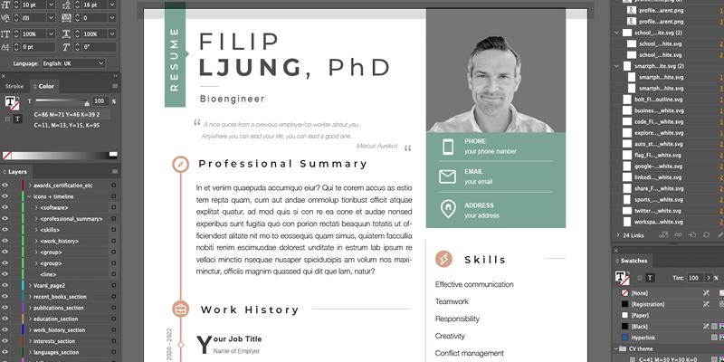

# Resume and cover letter template for Adobe InDesign/Illustrator

Feel free to use this template for your cover letter or resume. Regrettably, you need (expensive) Adobe software use this at the moment. An open source alternative is hopefully coming here soon. 

## Fonts 
Here are the (open source) fonts you need to install to get the same look as the original:  
- [Montserrat](https://fonts.google.com/specimen/Montserrat)
- [Helvetica Neue](https://freefontsvault.com/helvetica-neue-font/)
- [Alex Brush](https://fonts.adobe.com/fonts/alex-brush) Only used as placeholder for your (handwritten) signature.  
- Arial - you should have it :)

Google how to install the fonts in your operating system. 

## Icons
All icons are in .svg format, located in the icons folder in this repository. They were downloaded from Google Materials Icon pack](https://akveo.github.io/eva-icons/#/) August 2022, and recolored in white.  

The icons for google scholar and orcid comes from the [academicons project](https://jpswalsh.github.io/academicons/).

## LinkedIn
Connect with me on LinkedIn if you find this template useful :)

https://www.linkedin.com/in/filip-persson/

